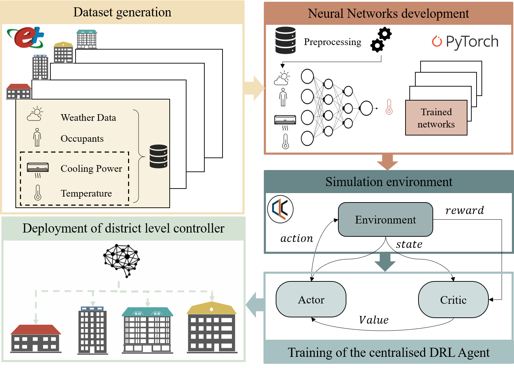

# EnergyManager Data-Driven District Energy Management

**Student:** Mohammed Amine Hssaine  
**Institution:** ENSAM Meknes  
**Program:** 4th Year AIDT  
**Email:** m.hssaine@edu.umi.ac.ma

---

<h3 align="center">EnergyManager Data-Driven District Energy Management</h3>

<p align="center">
  EnergyManager is an open source OpenAI Gym environment built on top of Citylearn for the implementation of 
  Multi-Agent Rya einforcement Learning (RL) for building energy coordination and demand response in cities. 
  The peculiarity of the environment lies in the ability to simulate internal building dynamics of multiple buildings
   using data-driven models (DNNs). The aim is to ease the deployment of data-driven controller that can consider 
   internal building environment and coordination and cooperation among multiple buildings.
</p>

## Description
Districts and cities have periods of high demand for electricity, which raise electricity prices and the overall cost of the power distribution networks. Flattening, smoothening, and reducing the overall curve of electrical demand helps reduce operational and capital costs of electricity generation, transmission, and distribution networks. Demand response is the coordination of electricity consuming agents (i.e. buildings) in order to reshape the overall curve of electrical demand.

Furthermore, building thermal mass can be used as an additional source of energy flexibility, if properly harnessed. Furthermore, demand response should not influence users comfort, requiring for a precise representation of the internal environment. EnergyManager allows the easy implementation of reinforcement learning agents in a multi-agent setting to control HVAC and storage of multiple buildings, with the aim to reshape their aggregated curve of electrical demand, while ensuring users comfort. 

Currently, EnergyManager allows controlling the storage of domestic hot water (DHW), chilled water and HVAC (for sensible cooling and dehumidification). EnergyManager also includes models of air-to-water heat pumps, electric heaters, solar photovoltaic arrays, and pre-computed energy loads of the buildings, that can be used as benchmarks for indoor environment temperature evolution.

<br />
<p align="center">
  <a href="images/framework.png">
    
  </a>
</p>

## Project Structure

```
EnergyManager/
├── src/                # Source code for the environment and agents
│   ├── energy_manager.py
│   ├── energy_models.py
│   ├── functions.py
│   ├── agent.py
│   └── reward_function.py
├── data/               # Data files for climate zones and buildings
├── models/             # Pre-trained building dynamic models
├── images/             # Images for documentation
├── main.py             # Main entry point for running simulations
├── requirements.txt    # Python dependencies
└── README.md           # Project documentation
```

## Dependencies
Install the required libraries using pip:

```bash
pip install -r requirements.txt
```

Key dependencies:
- gym==0.17.2
- numpy==1.18.4
- pandas==1.2.1
- stable-baselines==2.10.0
- tensorflow==1.14.0
- torch==1.6.0

## Usage

To run the simulation with the default configuration:

```bash
python3 main.py
```

This will execute the `main.py` script which demonstrates:
1. **No Storage Case**: Baseline simulation without energy storage.
2. **RBC (Rule-Based Controller)**: A simple rule-based control strategy.
3. **SAC (Soft Actor-Critic)**: A reinforcement learning agent (Centralized).

## Files Description

- **[main.py](main.py)**: Example of the implementation of a reinforcement learning agent (centralized SAC) for the four buildings in EnergyManager.
- **[src/energy_manager.py](src/energy_manager.py)**: Contains the `EnergyManager` environment class.
- **[src/energy_models.py](src/energy_models.py)**: Contains classes for `Building`, `HeatPump`, `EnergyStorage`, etc.
- **[src/agent.py](src/agent.py)**: Implementation of the SAC RL algorithm.
- **[src/functions.py](src/functions.py)**: Helper functions for KPIs and discomfort metrics.
- **[src/reward_function.py](src/reward_function.py)**: Reward function definitions.

## License
MIT License
Copyright (c) 2026 Mohammed Amine Hssaine
